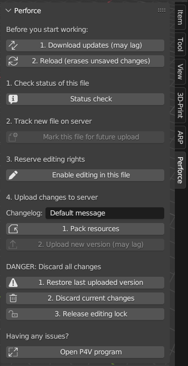
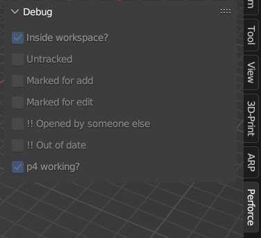
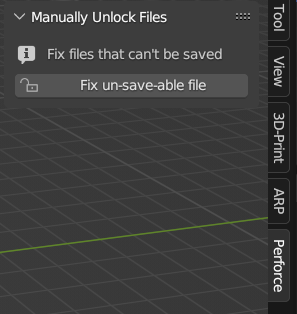
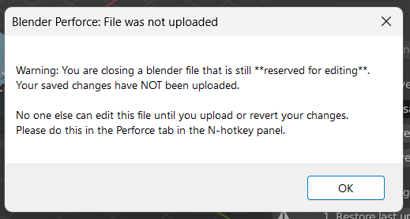
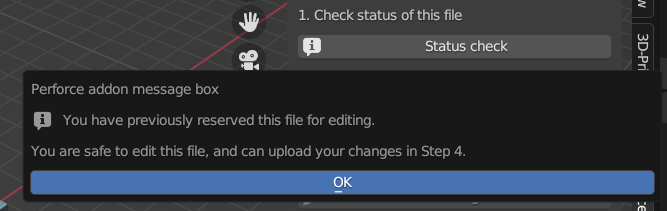
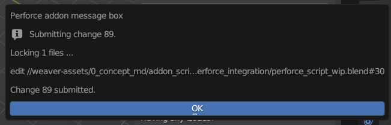
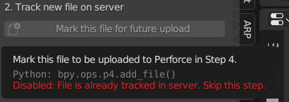
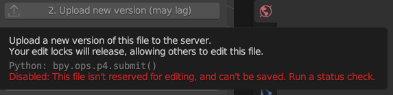
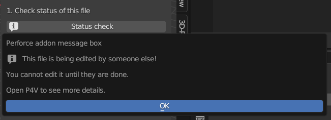

# perforce-blender-addon
A Blender 3.0+ addon that allows Perforce users to check-in / check-out files with a Blender UI panel. Perforce Helix (`p4` and `p4v`) must be installed.

## Installation
Download the Python file and import it to Blender as an add-on.

## Screenshots

  * "Download updates": `p4 sync`
  * "Status check": plain-English translation of `p4 fstat`
  * "Mark this file for future upload": `p4 add`
  * "Enable editing in this file": `p4 edit`
  * "Upload new version": `p4 submit`
  * "Restore last uploaded version": `p4 revert`
  * "Open P4V program": `p4v`

---

## Features

* Provide a side-panel GUI with plain-English buttons for **common p4 commands**
* Warn users if they try to check-out a file that **someone else has locked**
* Warn users if their file is **out of date**
* (Windows only) Warn users when they close a file that has been added or checked-out, but **not submitted**.
  * This helps remind users to submit files after they finish.
* UI panel dynamically enables and disables buttons depending on `p4 fstat` info
  * For example, the `p4 add` button is disabled for already-tracked files
* UI panel **hides itself** when file is unsaved
* **Manual unlock tool** for locked files which are copied outside a Perforce workspace
* No significant impact on Blender performance - does not query Perforce server until the user clicks Status check button

## Future updates (aspirational)

* Repackage this addon into a .zip file
* Improve the UX of the N-panel
* Add loading bars for lag-intensive operations
* Create a separate text descriptor file to more easily edit tooltips
* Support popup windows on Mac and Linux by bundling `tkinter`

## Author info

My name is Alex Vuong - I am a student at Arizona State University.

I study creative production for 3D and VR/XR animation, with a focus in technical art and creative team management.

I am aiming to become either a PM, Producer, or Technical Artist, depending on the field (animation, games, software, etc).

Contact me at AlexV@asu.edu if you have questions about this addon, or anything else!
